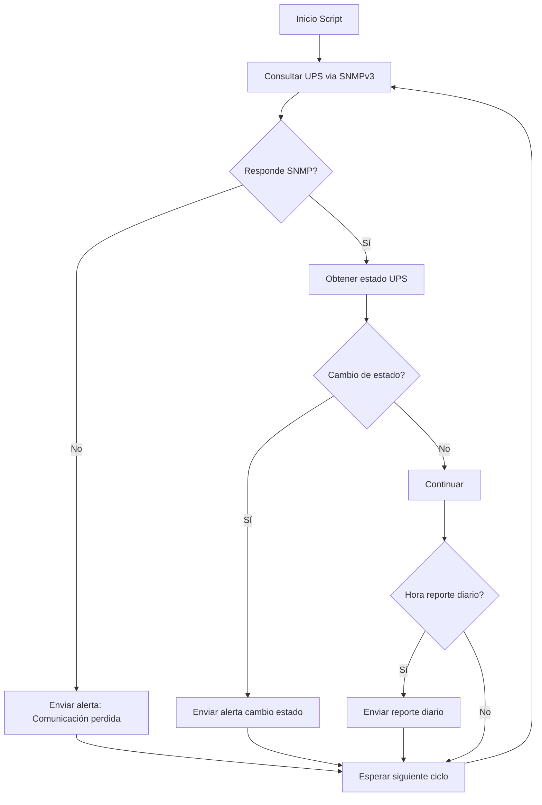

# telegram-bot-ups

Bot de Monitoreo de UPS

```mermaid
flowchart TD
    A[Inicio Script] --> B[Consultar UPS via SNMPv3]
    B --> C{Responde SNMP?}
    C -- No --> D[Enviar alerta: Comunicación perdida]
    C -- Sí --> E[Obtener estado UPS]

    E --> F{Cambio de estado?}
    F -- Sí --> G[Enviar alerta cambio estado]
    F -- No --> H[Continuar]

    H --> I{Hora reporte diario?}
    I -- Sí --> J[Enviar reporte diario]
    I -- No --> K[Esperar siguiente ciclo]

    J --> K
    D --> K
    G --> K
    K --> B
```

